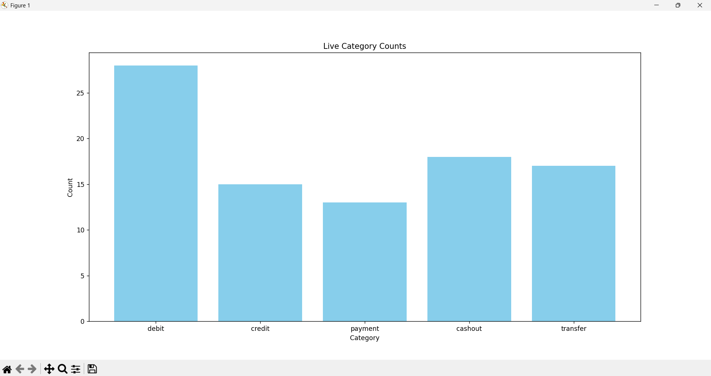
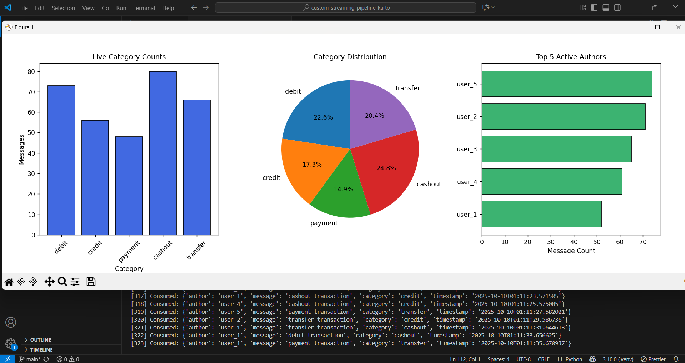
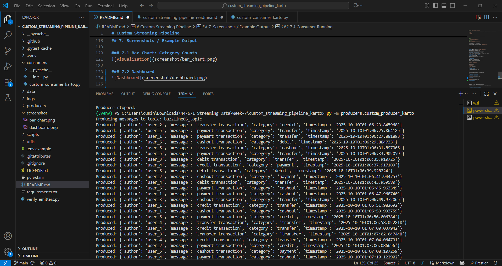
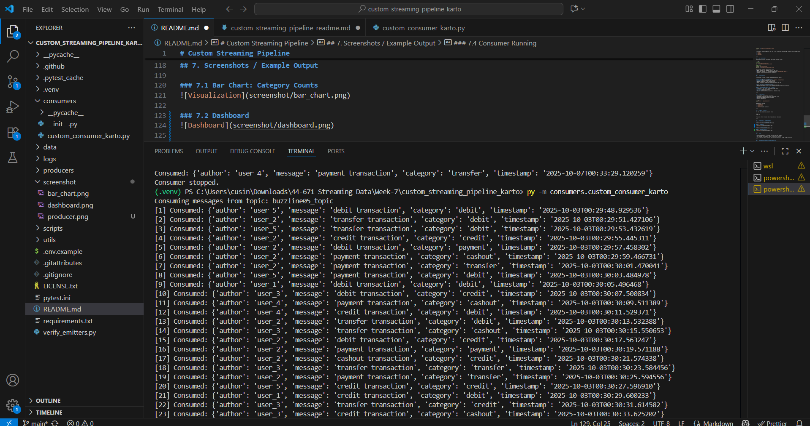

# Custom Streaming Pipeline

This project demonstrates a real-time streaming pipeline using Apache Kafka and Python.
Messages are produced into a Kafka topic and consumed by a Python consumer that stores data in SQLite and updates three live visualizations.

---

## 1. Start WSL (Windows Only)

If you are using Windows, launch WSL (Windows Subsystem for Linux).  
Open a PowerShell terminal in VS Code and run:

```powershell
wsl
```

You should now be in a Linux shell (prompt shows something like `username@DESKTOP:.../repo-name$`).  
All Kafka-related commands must be run in this WSL shell.

---

## 2. Run the Producer

Activate your virtual environment and run the producer script:

```bash
# Windows
.\.venv\Scripts\Activate.ps1
py -m producers.custom_producer_karto

# Mac/Linux
source .venv/bin/activate
python3 -m producers.custom_producer_karto
```

The producer sends messages in real time to the Kafka topic. Each message contains the following fields:
- `author`
- `message`
- `category`
- `timestamp`

---

## 3. Run the Consumer

Activate your virtual environment and run the consumer script:

```bash
# Windows
.\.venv\Scripts\Activate.ps1
py -m consumers.custom_consumer_final

# Mac/Linux
source .venv/bin/activate
python3 -m consumers.custom_consumer_final
```

The consumer performs the following tasks:
- Reads messages from the Kafka topic in real time.
- Stores all messages in a local SQLite database (`data/messages.sqlite`).
- Updates three live visualizations dynamically.

---

## 4. Visualizations

The consumer provides a dynamic dashboard with three charts:

### 4.1 Bar Chart: Live Category Counts
- **X-axis:** Message categories (e.g., `payment`, `transaction`)  
- **Y-axis:** Count of messages per category  
- Updates dynamically as new messages arrive  
- Helps track which categories are most active in real time

### 4.2 Pie Chart: Category Distribution
- Shows percentage share of each category in real time  
- Provides an instant visual of how messages are distributed across categories

### 4.3 Horizontal Bar Chart: Top 5 Authors
- Tracks the 5 most active authors by message count  
- **X-axis:** Number of messages  
- **Y-axis:** Author names  
- Quickly identifies top contributors in the data stream

---

## 5. Project Setup

- Ensure Kafka and Zookeeper are running  
- Create the Kafka topic if it does not already exist  
- Activate your Python virtual environment  
- Install dependencies:

```bash
pip install -r requirements.txt
```

Dependencies include:
- `kafka-python`  
- `python-dotenv`  
- `matplotlib`  
- `sqlite3` (Python built-in)

---

## 6. Stopping Processes

To stop the consumer or producer, press:

```
CTRL + C
```

This will safely terminate the script and close the charts.

---

## 7. Screenshots / Example Output

### 7.1 Bar Chart: Category Counts


### 7.2 Dashboard


### 7.3 Producer Running


### 7.4 Consumer Running


---

## 8. Notes

- Charts update every 0.1 seconds for near-real-time feedback  
- All messages are stored in SQLite for historical analysis  
- The project is modular: you can add new visualizations or change categories easily

---

## 9. Enjoy Monitoring Your Live Streaming Data

